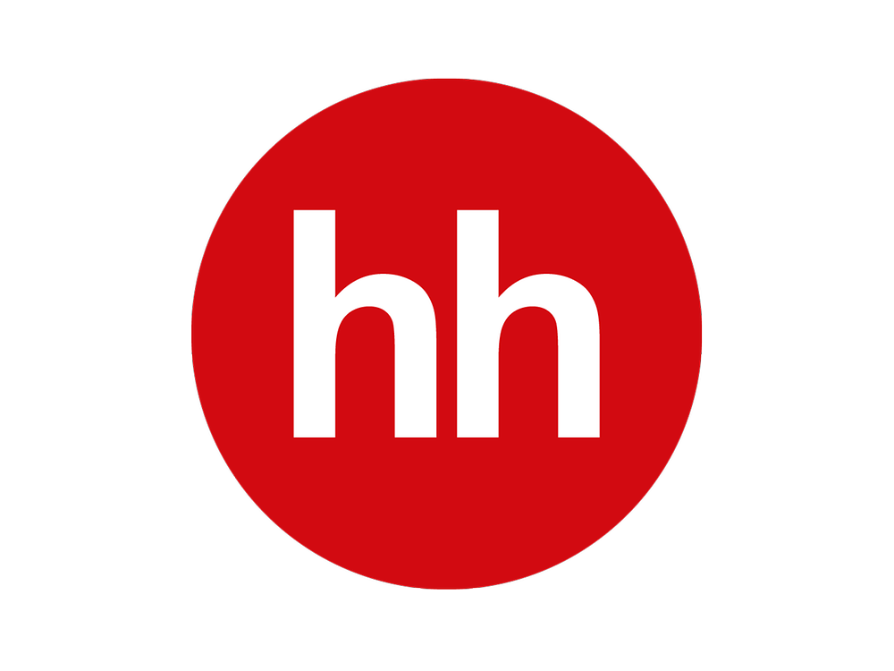

<h1 align="center">Hi there, I'm <a href="https://github.com/LuKirill" target="_blank">Kirill</a> 
</h1>
<h3 align="center">I currently learning Python and dreaming of working as a real developer. </h3>

  <b>My CV:</b>
   
  
   
  <b>My contacts:</b>
   
  
  
  
  
  
  
<i>💬 If you have any question/feedback, please do not hesitate to reach out to me!</i>

  
<i>Preferred contact method is Telegram.</i>

  
In programming, I am motivated by the ability to create something new, solve interesting problems, as well as unlimited scope for personal development and career growth, because I don’t like to stagnate and turn sour otherwise.

<!--
**LuKirill/LuKirill** is a ✨ _special_ ✨ repository because its `README.md` (this file) appears on your GitHub profile.

Here are some ideas to get you started:

- 🔭 I’m currently working on ...
- 🌱 I’m currently learning ...
- 👯 I’m looking to collaborate on ...
- 🤔 I’m looking for help with ...
- 💬 Ask me about ...
- 📫 How to reach me: ...
- 😄 Pronouns: ...
- ⚡ Fun fact: ...
-->
